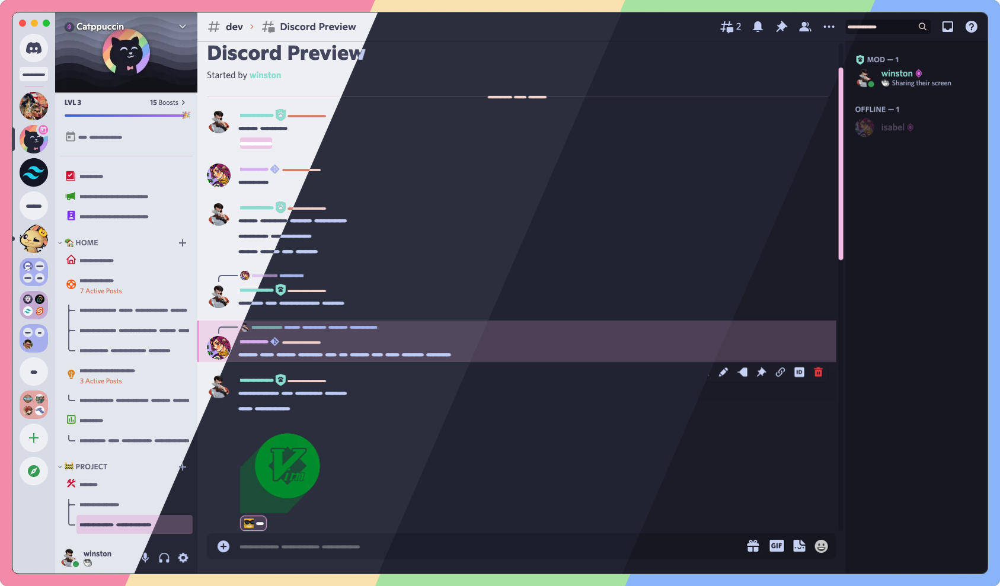
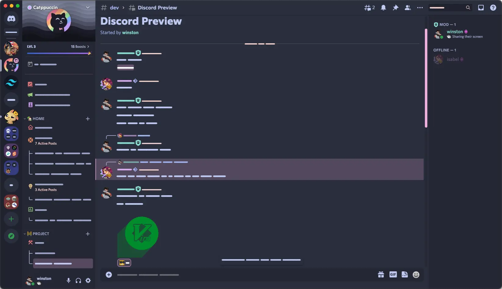
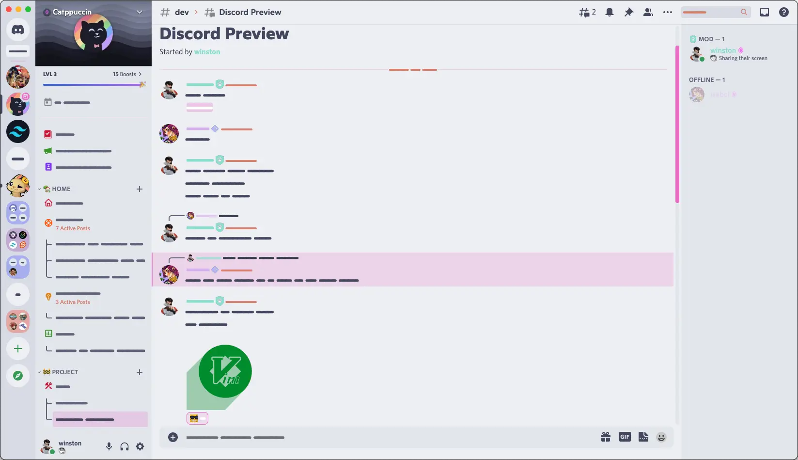
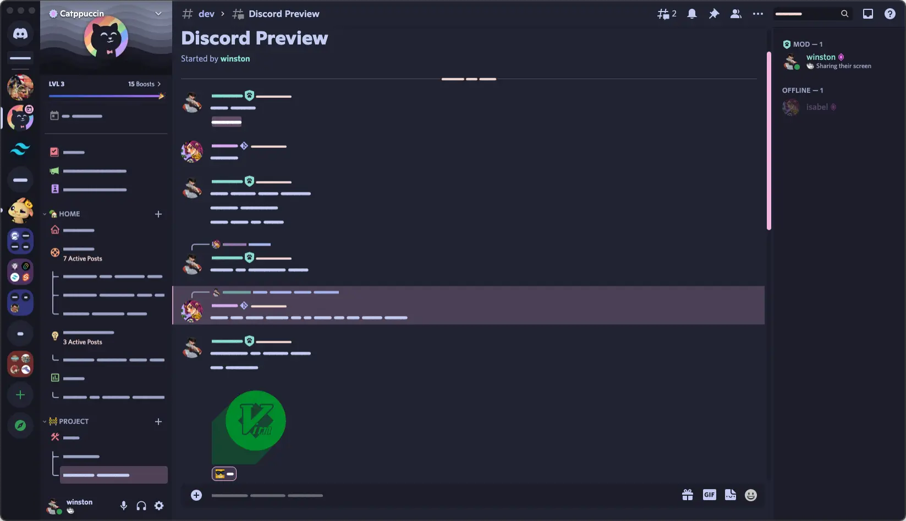
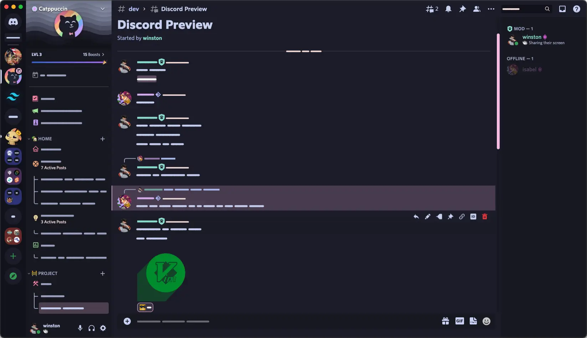

[discord]:          https://discord.gg/uy8nKQVatp

[Replugged]:        https://replugged.dev/

[shield-donate]:    https://img.shields.io/badge/Donate-ko--fi-orange?style=flat-square&logo=kofi&logoColor=orange
[ko-fi]:            https://ko-fi.com/saltssaumure "Buy me a coffee!"

[shield-asar-dl]:   https://img.shields.io/github/downloads/TakenMC/Catppuccin/total?color=purple&label=Downloads&style=flat-square
[shield-repo-size]: https://img.shields.io/github/repo-size/TakenMC/Catppuccin?label=Repository&style=flat-square "Total size"

[github]:           https://github.com/TakenMC/Catppuccin
[issues]:           https://github.com/TakenMC/Catppuccin/issues
[license]:          https://github.com/TakenMC/Catppuccin/blob/main/LICENSE

[cat]: 				https://github.com/catppuccin/discord
[cat-author]: 		https://github.com/catppuccin
[cat-license]: 		https://github.com/catppuccin/discord/blob/main/LICENSE

[release-rp-frappe]:    https://replugged.dev/store/org.mairimashita.Catppuccin.Frappe "Replugged store page"
[release-rp-latte]:  	https://replugged.dev/store/org.mairimashita.Catppuccin.Latte "Replugged store page"
[release-rp-macchiato]: https://replugged.dev/store/org.mairimashita.Catppuccin.Macchiato "Replugged store page"
[release-rp-mocha]: 	https://replugged.dev/store/org.mairimashita.Catppuccin.Mocha "Replugged store page"
[release-rp-gh]:        https://github.com/TakenMC/Catppuccin/releases/latest "Get latest release"

# Catppuccin Discord Theme
[![Buy me a coffee on ko-fi][shield-donate]][ko-fi]
[![Replugged GitHub downloads][shield-asar-dl]][release-rp-gh]
[![Total repository size][shield-repo-size]][github]

***A Replugged fork of [Catppuccin][cat-author]'s [Discord theme][cat] - soothing pastel themes in four flavors.***

## Previews
| Flavor      | Screenshot                                  |
| ----------- | ------------------------------------------- |
| 🪴 Frappé    |        |
| 🌻 Latte     |          |
| 🌺 Macchiato |  |
| 🌿 Mocha     |          |

## Installation

### [Replugged][Replugged]
#### Automatic
1. Click to install from the Replugged store:
    - [🪴 Frappé][release-rp-frappe]
    - [🌻 Latte][release-rp-latte]
    - [🌺 Macchiato][release-rp-macchiato]
    - [🌿 Mocha][release-rp-mocha]
#### Manual
1. Download `org.mairimashita.Catppuccin.<Flavor>.asar`:
    - [GitHub][release-rp-gh]
2. Place the file in the themes folder:
    - `Settings` > `Replugged` > `Themes` > `Open Themes Folder`
3. Click `Load Missing Themes` and toggle on the theme card.

## Credits

[Saltssaumure ](https://github.com/Saltssaumure) for porting the theme for easier build to Replugged.

## License
[MIT License][license]
- TL;DR;NAL: Do whatever you want with this theme, just include the original license.

### Includes
- [Catppuccin Discord][cat] by [Catppuccin][cat-author] - [MIT License][cat-license]

## Questions or suggestions?
- Post [an issue][issues] on GitHub.
- Post in `#theme-support` on [my support server][discord].
